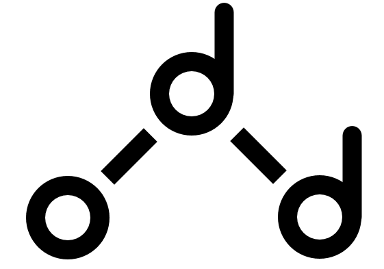

# Odd Parser Generator

<div align="center"></div>

The Odd Parser Generator is a parser generator written in javascript.

<br/>
<br/>

## 🧠 Philosophy
To make a computer understand the syntax of a language, you need to tell it exactly how to understand your sentences. That is where a parser comes in: it understands text and can transform it into its syntactical parts (a "syntax tree").

You could write a parser by hand, but that reduces the flexibility and development speed of your end product (language). This is why _Parser Generators_ are made. For the same reason the Odd Parser Generator was made: to allow for quick and flexible language definition(s).

### Why not use existing tools?
Odd originally was a hobby project, which is a valid reason on its own. That meant that working on it had to be fun, or at least lead to a fun experience. Using existing tools was not fun. They are often old, ugly, and mix concerns that should be separated. Most parser generators invent their own meta-version of the language it was implemented in, resulting in -- for example -- an ugly antlr-file that is both some form of language declaration, and a program.

<details>
<summary>An example of such a file</summary>

[Excerpt taken from WikiPedia](https://en.wikipedia.org/wiki/ANTLR)
```antlr
 // Common options, for example, the target language
 options
 {
  language = "CSharp";
 }
 // Followed by the parser 
 class SumParser extends Parser;
 options
 {
   k = 1; // Parser Lookahead: 1 Token
 }
 // Definition of an expression
 statement: INTEGER (PLUS^ INTEGER)*;
 // Here is the Lexer
 class SumLexer extends Lexer;
 options
 {
   k = 1; // Lexer Lookahead: 1 characters
 }
 PLUS: '+';
 DIGIT: ('0'..'9');
 INTEGER: (DIGIT)+;
```
_What are these classes and lexical definitions doing in my parser definition file?_

</details>

<br/>

Even if the Odd Parser Generator would not be faster than (or as fast as) existing tools, at least it should be vastly more intuitive and pleasureable to use (as long as you know (E)BNF 🙃).

<br/>
<br/>

## Usage
The parser generator is used by javascript from javascript. No weird sub- or superset.

### TL;DR

[Skip to in-depth explanation with examples ->](#in-depth-explanation)

To create a parser you just import the API:
```js
import Parser from "Parser.js";

export new Parser();
```

The Parser API has two methods.

<br/>

<code>_Parser_: **rule**(_string_: **name**, _ParserCombinator_: **parser**)</code>

Define a rule for the parser to recognise. You can reference a rule with the `rule` _parser combinator_, or by directly referencing another function.

The `rule` parser combinator allows for referencing functions that are yet to be defined, which is disallowed in some cases in javascript:

<details>

<summary>Click here to view such a case</summary>

```js
//The following will throw:
const a = b();
const b = () => {};
new Parser()
  .rule("a", a)
  .rule("b", b);
// > Uncaught ReferenceError: Cannot access 'b' before initialization

//The following will not throw:
const a = rule("b");
const b = () => {};
new Parser()
  .rule("a", a)
  .rule("b", b);
```

</details>

<br/>

A `ParserCombinator` must have the type signature `(ParseState, Map<Rule>, AsyncIterable<Token>) => Result` (heavily subject to change).

It's discouraged to write your own combinator from scratch. Use the builtin combinators to compose more complicated combinators.

<br/>

<code>_Promise\<Result\>_: **parse**(_AsyncIterable\<Token\>_: **tokens**)</code>

Returns a `Promise` that will resolve to a `Result`. A `Result` is the internal representation of a parsing. To check if a result was succesful, check the `ok` property. The result can be regarded as the _parse tree_. You can call `.AST()` on a `Result` to get only the _abstract syntax tree_.

The parser also comes with some default combinators, which can be found under the static field `Parser.combinators`.

<br/>

<details>

<summary>Click here to view the builtin parser combinators</summary>

<br/>

<code>_Result_: **lexeme**(_string_: **expected**)</code>

The `lexeme` combinator takes an argument `expected`. This combinator returns a function that matches the first token whose key `lexeme` has the value of `expected`.

<br/>

<code>_Result_: **type**(_string_: **expected**)</code>

The `type` combinator takes an argument `expected`. This combinator returns a function that matches the first token whose key `type` has the value of `expected`.

<br/>

<code>_Result_: **sequence**(_ParserCombinator[]_: **...parsers**)</code>

The `sequence` combinator takes any sequence of parser combinators, and evaluates them in order. It returns a succesful `Result` if no parser failed. Otherwise it returns the first failed result.

<br/>

<code>_Result_: **some**(_ParserCombinator_: **parser**)</code>

The `some` combinator takes any parser and runs it until it doesn't match anything. It returns a succesful `Result` whether or not anything matched (zero or more).

<br/>

<code>_Result_: **many**(_ParserCombinator_: **parser**)</code>

The `many` combinator takes any parser and runs it until it doesn't match anything. It returns a succesful `Result` if one or more parses succeeded. If no parse was successful it returns the failed result.

<br/>

<code>_Result_: **maybe**(_ParserCombinator_: **parser**)</code>

The `maybe` combinator takes any parser and returns the `Result` of that parser, with its `ok` field always set to `true`.

<br/>

<code>_Result_: **rule**(_string_: **name**)</code>

The `rule` combinator takes an argument `name`. This combinator looks for a parser rule of name `name`. This is useful for when you want to reference a rule before its initialisation.

<br/>

<code>_Result_: **label**(_string_: **name**, _ParserCombinator_: **parser**)</code>

The `label` combinator takes the arguments `name` and `parser`. This combinator runs `parser` and adds the label `name` to it. This is useful for referring to this particular node.

<code>_Result_: **delimited**(_ParserCombinator_: **parser**, _ParserCombinator_: **delimiter**)</code>

The `delimited` combinator takes the arguments `parser` and `delimiter`. This combinator checks for the occurence of one or more `parser`, followed by zero or more sequences of `delimiter` followed by `parser` (EBNF: `x (y x)*`). This is useful for constucts such as rules delimited by a comma. It returns a succesful `Result` if at least one `parser` was succesful, or if it matched one or more `parser`s with `delimiter` between each `parser`.

</details>

<br/>
<br/>

### In-depth explanation

You create a definition file as follows:

```js
import Parser from "Parser";
const { some, rule, sequence, many, type, lexeme } = Parser.combinators;

const program = some(
  rule("sentence"));

const sentence = sequence(
  many(
    type("word")),
    lexeme("."));

export new Parser()
  .rule("program", program)
  .rule("sentence", sentence);
```

This javascript file defines and exports a Parser that _recognises some sentences (zero or more), which consist of many tokens of type "word" (one or more), followed by a full stop_.

You might notice that the parser combinators make our parser look like a simple sentence. That is one of the powers of parser combinators.

Another great benefit is that they allow for really easy declaration of your own combinators:
```js
import Parser from "./Parser";
const { sequence, lexeme } = Parser.combinators;

const times = n => f =>
  sequence(...Array(n).fill(f));

const triple = times(3);

const ellipsis = triple(lexeme("."));
```

A useful way to formally communicate grammar is through [a special notation called Backus-Naur Form](https://en.wikipedia.org/wiki/Backus%E2%80%93Naur_form) or [a more intuitive EBNF](https://en.wikipedia.org/wiki/Extended_Backus%E2%80%93Naur_form).

The intention for the Odd Parser Generator is to also allow for EBNF rules to be declared, so that any language's specification written in EBNF would also be a valid program for the Odd Parser Generator.

The language used to define a parser would be similar to a superset of EBNF, called MetaOdd, which includes a small amount of helpful syntactic constructs, and changes a few notations.

MetaOdd defined in terms of itself:
```ebnf
program -> metarule*

metarule -> .identifier "->" chunks (end | EOF)

chunks -> chunk ("|" chunk)*

chunk -> ((.label? atom)+ | "(" chunks ")") quantifier?

atom -> .type
	| .identifier
	| .lexeme
	| .self

quantifier -> .quantifier | "{" .number ("," .number?)? "}"
```