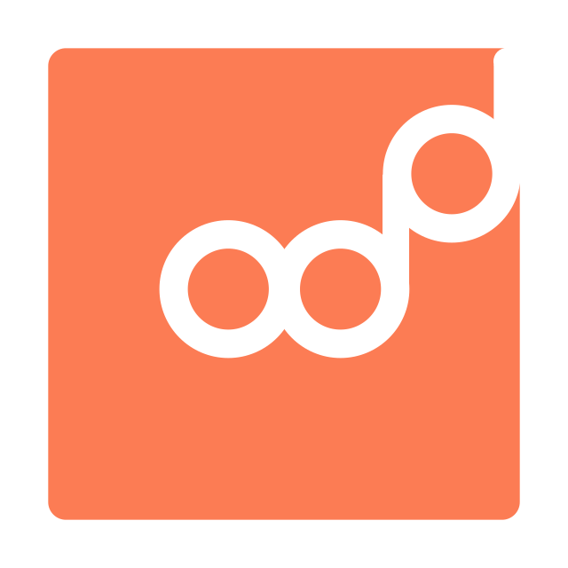

# Odd Language

<div align="center">


_Hmm, that's **odd**..._
</div>

<br/>
<br/>

## 🧠 Philosophy
Odd is highly W.I.P. but these are the main goals of the language:
- Expression oriented: people don't speak in steps.
- Flowing syntax (like a language should have).
- Small footprint: should work on high- and low-end devices.
- Adopt a good few parts of functional programming into developer mindset.

<br/>
<br/>

## 🖥️ Usage
To use the Odd compiler (not finished), run it through node:
```shell
node -v
# -> v13.12.0
node --harmony ./odd/compiler.js test.odd
# -> ✔️ Reading file DONE (292.70 μs)
# -> ✔️ Generating lexer DONE (233.90 μs)
# -> ✔️ Parsing DONE (12.41 ms)
# -> { children: [ ... ],
#      ok: true,
#      type: "program",
#      label: null,
#      error: null }
```
Should work with some older versions of Node, but Odd is being developed with the newest versions of node to guarantee best performance and the newest javascript features.

<br/>
<br/>

## 🗺️ Roadmap
Odd v1.0 requires the following compiler stages to be completed:
- [x] **0.1**: [Lexical Analysis](odd/lexer.js)
- [x] **0.2**: [Parsing](odd/parser.js)
- [ ] **0.3**: Semantic Analysis
- [ ] **0.4**: Type Validation
- [ ] **0.X**: At least one working compilation/transpilation target (probably javascript first)

<br/>
<br/>

## 🤸 Author
Conceptualised and authored by [@maanlamp](https://github.com/maanlamp). Feel free to contribute: [Create an issue](https://github.com/oddlanguage/odd/issues/new) or get in contact otherwise.

<br/>
<br/>

## © License
Copyright 2020 Maanlamp.
[This project is licensed under MIT](./LICENSE.txt).