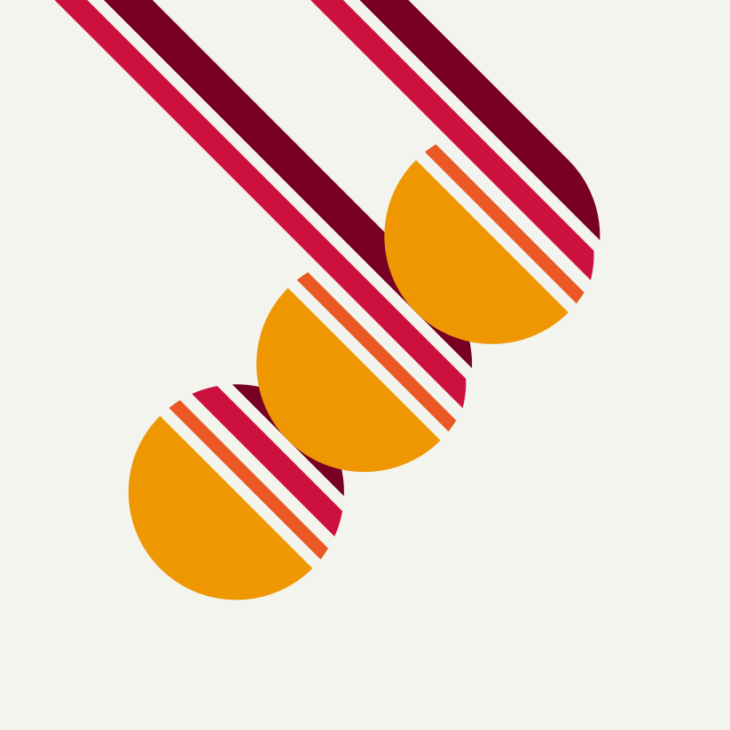

# Odd Language

<div align="center">


_Hmm, that's **odd**..._

</div>

<br/>
<br/>

## 🧠 Philosophy

Odd is highly W.I.P. but these are the main goals of the language:

- Odd must have functional, expressive and flowing syntax.
  - Programming "patterns" are often a sign of lacking expressiveness within a language. We like a solid language over SOLID patterns.
  - Programs are read far more often than they are written. Odd should contain little to no weird jumps in program flow for readers to trip over.
- Odd must have no (unnecessary) dependencies.
  - Full ownership of the codebase ensures any bug is our responsibility to fix, but also any feature ours to add.
- Odd must run on every machine (_within reason, of course_).
  - WebAssembly is a promising target platform to immediately work on most devices.
  - A tiny footprint should allow the language to be used or embedded anywhere. Imagine your IOT devices running Odd 🤯.
  - Having an old(er) or less powerful device should never be a reason to be unable to program.

<br/>
<br/>

## 🤸 Contribute

Feel free to contribute. [Please read our contributing guidelines](./CONTRIBUTING.md) and then [create an issue](https://github.com/oddlanguage/odd/issues/new) or [a pull request](https://github.com/oddlanguage/odd/pulls).

<br/>
<br/>

## 🖥️ Usage

> ℹ️ Odd is guaranteed to work with [NodeJS version 16.13.1](https://nodejs.org/dist/v16.13.1/), but should be compatible with earlier versions down to v12, possibly requiring the `--harmony` flag.

To try out Odd, download the repo and run it:

```sh
npm i; # install dependencies
npm run repl; # start a repl
```

> ℹ️ When Odd is finished, it will be a standalone executable requiring no separate Node installation, or any other dependency.

For a more in-depth look at how Odd works, [have a look at the documentation](docs/syntax.md).

<br/>
<br/>

## 🗺️ Roadmap

Some work has yet to be done for odd to release as v1.0. The following is a list of development milestones to get to **v1.0**:

- [x] **0.1**: CLI REPL
- [x] **0.2**: Modules
- [x] **0.3**: Pattern matching
- [ ] **0.4**: Type system
- [ ] **0.5**: LSP for proper editor integration
- [ ] **0.6**: Intelligble and helpful errors

> ...

- [ ] **1.0**: 🏁 Standalone executable for real-world use.

<br/>
<br/>

## © License

Conceptualised and authored by [@maanlamp](https://github.com/maanlamp).
[This project is licensed under MIT](./LICENSE.txt).
